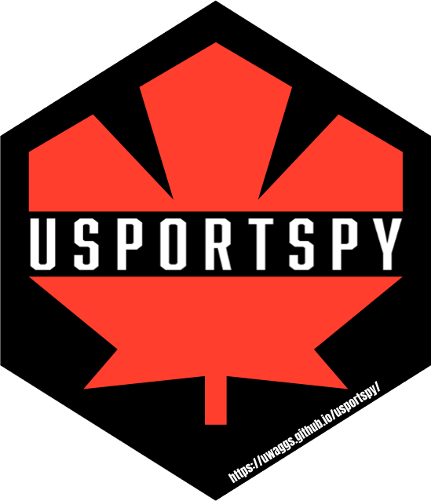

<div style="display: flex; justify-content: space-between; align-items: center;">
  <h1 style="margin: 0;">usportspy</h1>
  
</div>


---

## Overview

This package is designed to extract and analyze data from U SPORTS, the governing body of university sport in Canada.

## Installation

You can install and use `usportspy` by runnning:

```
pip install usportspy
```

## Usage

Here's a quick example of how to use `usportspy` to get the men's basketball schedule:

```
from usportspy import basketball_get_schedule

male_schedule = basketball_get_schedule("m")
print(male_schedule.head())
```

---

## Contributing

Interested in contributing? If you'd like to add features, fix bugs, or improve documentation, please:

1. Fork the repository.
2. Create a new branch.
3. Make your changes with clear commits.
4. Submit a pull request.

Before contributing, please read the [contribution guidelines](CONTRIBUTING.md).

---

## License

`pycounts` was created by uwaggs. It is licensed under the MIT license.

---

## Credits
